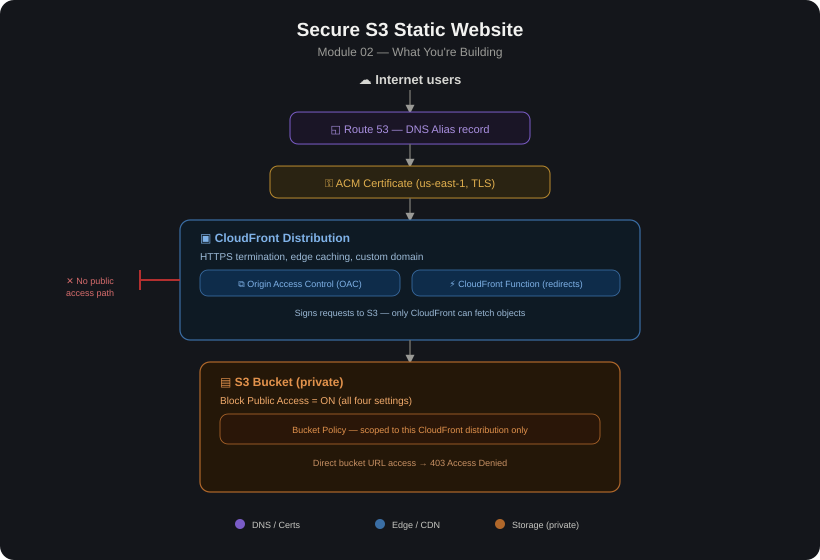

# 02 — Secure S3 Static Website

## Overview
This module hosts a **static website on Amazon S3**, fronted by **CloudFront** for HTTPS, caching, and global delivery — with the bucket itself kept **private** (no public bucket policy, no public ACLs). Public access is only possible through CloudFront, using **Origin Access Control (OAC)** to let CloudFront read from the bucket while everything else is blocked.

This is the modern, secure pattern — older tutorials often show "S3 static website hosting" with a public bucket policy directly serving HTTP traffic; this module intentionally avoids that in favor of CloudFront + OAC + HTTPS.

### Why Not Just a Public S3 Bucket

| | Public S3 website endpoint | S3 (private) + CloudFront + OAC |
|---|---|---|
| **Protocol** | HTTP only (no native HTTPS on the S3 website endpoint) | HTTPS via CloudFront + ACM certificate |
| **Bucket exposure** | Bucket policy must allow `s3:GetObject` to `*` | Bucket stays private; only CloudFront can read it |
| **Performance** | Single region, no edge caching | Cached at CloudFront edge locations globally |
| **Custom domain** | Possible but no HTTPS without extra proxy | Native via CloudFront + Route 53 + ACM |
| **Access control** | All-or-nothing public | Can add WAF, signed URLs/cookies, geo-restriction |

## Core Components

| Component | Purpose |
|---|---|
| **S3 Bucket** | Stores the static site files (HTML/CSS/JS/images). Block Public Access = ON (all four settings). |
| **CloudFront Distribution** | CDN in front of the bucket; terminates HTTPS, caches content at edge locations, enforces access control. |
| **Origin Access Control (OAC)** | Modern replacement for the older OAI (Origin Access Identity). Lets CloudFront sign requests to S3 so only CloudFront can fetch objects. |
| **Bucket Policy** | Scoped to allow `s3:GetObject` only from the specific CloudFront distribution (via OAC), not the public. |
| **ACM Certificate** | TLS certificate (must be requested in us-east-1 for CloudFront) for the custom domain. |
| **Route 53** | DNS — points your custom domain (via an Alias record) at the CloudFront distribution. |
| **CloudFront Function / Lambda@Edge** *(optional)* | Handles things like default-index redirects for subdirectories (`/about/` → `/about/index.html`), since S3 origins behind CloudFront don't natively support the "index document" trick the S3 website endpoint offers. |

## Build Steps

1. **Create the S3 bucket**
   - Enable Block all public access (all 4 checkboxes ON).
   - Upload site files (`index.html`, `error.html`, assets).
   - Do **not** enable "Static website hosting" in bucket properties — that feature is for the public HTTP endpoint pattern; skip it for the secure pattern (use the bucket as a plain REST origin instead).
2. **Request an ACM certificate** (in us-east-1, required for CloudFront)
   - For your custom domain (e.g. `www.example.com`), validate via DNS (Route 53 can auto-create the validation CNAME).
3. **Create the CloudFront distribution**
   - Origin = the S3 bucket (REST endpoint, not the website endpoint).
   - Origin access = Origin Access Control (OAC) → create new OAC.
   - Viewer protocol policy = Redirect HTTP to HTTPS.
   - Attach the ACM certificate + custom domain (Alternate Domain Name/CNAME).
   - Default root object = `index.html`.
4. **Update the S3 bucket policy**
   - CloudFront will prompt you to copy a bucket policy statement that grants `s3:GetObject` only to `cloudfront.amazonaws.com` with a condition matching your specific distribution's ARN — apply this exactly, don't broaden it.
5. **Point DNS at CloudFront**
   - In Route 53, create an Alias A record (and AAAA for IPv6) for your domain pointing at the CloudFront distribution's domain name.
6. **Handle default documents for sub-paths** (if needed)
   - Add a small CloudFront Function (viewer request) to rewrite `/some-path/` → `/some-path/index.html`, since S3-as-REST-origin doesn't do this automatically like the website endpoint does.
7. **(Optional) Add AWS WAF** in front of CloudFront for extra protection (rate limiting, common exploit rule sets, geo-blocking).
8. **Test** — confirm the site loads over HTTPS via the custom domain, and confirm the raw S3 bucket URL / website endpoint returns Access Denied when hit directly.

## Lessons Learned

- ACM certificate must be in `us-east-1` regardless of which region your bucket/other resources live in — CloudFront only reads certs from that region.
- OAC vs. OAI — OAI is the legacy method; AWS recommends OAC now (supports SSE-KMS-encrypted objects and all S3 regions). Use OAC unless you have a specific legacy reason not to.
- Forgetting to update the bucket policy after creating the distribution is the most common reason for `403 Access Denied` — OAC alone doesn't grant access; the bucket policy statement has to be added.
- Caching stale content — after deploying updated site files, remember to invalidate the CloudFront cache (`/*` or specific paths) or set short TTLs during active development.
- Trailing-slash / index document behavior differs from the classic S3 website endpoint — don't assume `/blog/` will auto-resolve to `/blog/index.html` without a CloudFront Function/Lambda@Edge rule.
- Error pages — configure CloudFront custom error responses (e.g. map S3's 403 on missing object to a custom `404.html` with HTTP 404) since S3 REST origin errors aren't as friendly as the website endpoint's.
- Don't mix S3 "Static website hosting" mode with OAC — that feature exposes an HTTP-only public endpoint; if it's enabled alongside strict bucket policies, you can end up with a confusing, partially-secured setup.
- **Once you've completed this lab, delete the resources you created** — the CloudFront distribution (disable it first, then delete once disabled), the S3 bucket and its objects, and the ACM certificate if no longer needed — CloudFront distributions and S3 storage will keep charging your AWS account every month if left running.

## Validation Checklist

- [ ] `https://<your-domain>` loads the site correctly
- [ ] HTTP requests to the domain redirect to HTTPS
- [ ] Direct S3 bucket URL (REST or website endpoint) returns `403`/`Access Denied`
- [ ] ACM certificate shows `Issued` and matches the domain
- [ ] CloudFront distribution status = `Deployed`
- [ ] Cache invalidation actually reflects updated content
- [ ] (If WAF added) blocked test request actually gets blocked
