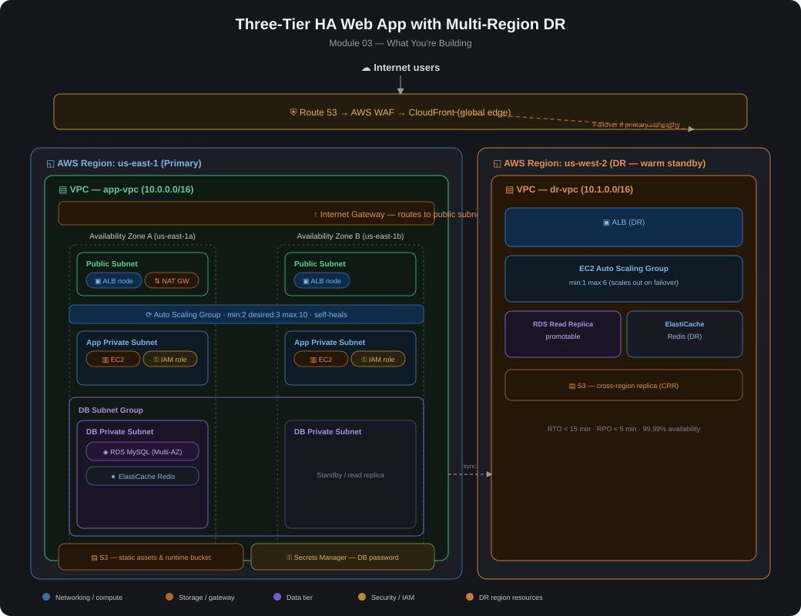

# 03 — Multi-Tier Application: ALB + ASG + RDS (with Multi-Region DR)

Full detailed diagram: [three-tier-ha-dr-architecture.png](./three-tier-ha-dr-architecture.png)

## Overview
This module builds a three-tier, highly available web application on AWS with automated multi-region disaster recovery. The goal is to demonstrate a production-realistic pattern — public/private/data subnet separation, Auto Scaling behind an ALB, Multi-AZ RDS, and a warm-standby DR region — rather than a toy single-AZ deployment.

**Design targets:**
- 99.99% availability
- RTO < 15 minutes
- RPO < 5 minutes

**Primary Region:** us-east-1 | **DR Region:** us-west-2 (warm standby)

## Core Components

| Layer | Service | Purpose |
|---|---|---|
| Edge/Security | Route 53 | DNS failover routing, health-check-triggered failover |
| Edge/Security | AWS WAF | OWASP rule set at the edge |
| Edge/Security | CloudFront | Global CDN distribution |
| Edge/Security | ACM | TLS/SSL certificates |
| Networking | VPC (10.0.0.0/16 primary, 10.1.0.0/16 DR) | Isolated network per region |
| Networking | NAT Gateways (×3) | Outbound internet for private subnets |
| Compute | Application Load Balancer | Multi-AZ traffic distribution |
| Compute | EC2 (t3.medium) + Auto Scaling Group | App tier, min:2 desired:3 max:10 (primary), min:1 max:6 (DR) |
| Data | RDS MySQL (Multi-AZ) | Primary + standby, DR read replica (promotable) |
| Data | ElastiCache Redis | Primary + replica (in-region), DR replica |
| Data | S3 + Cross-Region Replication | Static assets, continuous sync to DR |
| CI/CD | CodePipeline | Deployment automation |
| Security | Secrets Manager, KMS, GuardDuty | Credential management, encryption, threat detection |
| Operations | CloudTrail, AWS Config, AWS Backup (35-day), SSM, CloudWatch | Audit, compliance, monitoring |

## Build Steps

1. **Provision primary VPC** (10.0.0.0/16) across 3 AZs in us-east-1 with public, private (app), and DB subnets in each AZ.
2. **Deploy NAT Gateways** in each public subnet for private subnet egress.
3. **Deploy the Application Load Balancer** across the 3 public subnets.
4. **Create the Auto Scaling Group** (EC2 t3.medium, min:2 desired:3 max:10) in the private app subnets, registered to the ALB target group.
5. **Deploy RDS MySQL Multi-AZ** in the DB subnets (primary + synchronous standby).
6. **Deploy ElastiCache Redis** (primary + replica) alongside RDS.
7. **Set up CodePipeline** for CI/CD into the ASG.
8. **Provision the DR VPC** (10.1.0.0/16) in us-west-2 with matching subnet structure.
9. **Deploy a warm-standby ALB + ASG** in DR (min:1 max:6) — intentionally smaller than primary to reduce idle cost.
10. **Create an RDS Read Replica** in DR, configured as promotable.
11. **Configure ElastiCache Redis (DR)** and **enable S3 Cross-Region Replication** for continuous data sync.
12. **Configure Route 53 health checks** against the primary ALB/WAF endpoint with automatic failover routing to the DR ALB.
13. **Layer in security and operations tooling**: WAF rules, ACM cert, Secrets Manager, KMS, GuardDuty, CloudTrail, Config, AWS Backup, SSM, CloudWatch alarms/dashboards.
14. **Test failover**: simulate primary region health check failure, confirm Route 53 shifts traffic, confirm RDS replica promotion path, confirm S3 CRR data is current.

## Lessons Learned
- **Route 53 health check granularity matters.** Pointing the health check at the ALB alone doesn't catch application-level failures (e.g., a healthy ALB serving 500s from a broken app tier) — the check needs to hit an actual app health endpoint, not just infrastructure.
- **Warm standby sizing is a real cost/RTO tradeoff.** Setting DR ASG `min:1` keeps idle cost low but adds scale-out time during failover — this is a tradeoff worth explicitly load-testing for any real deployment, since scale-out time under load can vary from theoretical estimates.
- **RDS read replica promotion is not instantaneous**, and replication lag can spike under heavy primary write load — an RPO target should be validated against realistic write throughput, not just idle-state replication lag.
- **S3 CRR has propagation delay for large objects.** Cross-region replication is asynchronous — DR region S3 shouldn't be assumed byte-for-byte current at the moment of failover.
- **Subnet CIDR planning across regions should avoid overlap** if VPC peering or a transit gateway might be added later — `10.0.0.0/16` (primary) and `10.1.0.0/16` (DR) leave room for that.
- **Once you've completed this lab, delete the resources you created** — EC2/ASG instances, ALBs, RDS (both primary and DR read replica), ElastiCache, NAT Gateways — these bill continuously across both regions and will keep charging your AWS account every month if left running.

## Validation Checklist
- [ ] ALB health checks show all EC2 instances in the ASG as healthy across all 3 AZs
- [ ] Auto Scaling Group scales out correctly under simulated load (verify via CloudWatch + scaling activity history)
- [ ] RDS Multi-AZ failover tested (manually reboot with failover) and app tier reconnects without manual intervention
- [ ] ElastiCache Redis replica promotes correctly on primary node failure
- [ ] Route 53 health check correctly detects a simulated primary region outage
- [ ] Traffic fails over to DR region ALB within the RTO target (<15 min), measured end-to-end
- [ ] RDS read replica in DR promotes successfully and accepts writes post-failover
- [ ] S3 CRR replica in DR region matches primary bucket contents (spot-check object hashes)
- [ ] WAF rules block a known OWASP test payload (e.g., simple SQLi/XSS string) at the edge
- [ ] CloudTrail logs capture all infrastructure changes made during this build
- [ ] AWS Config shows no non-compliant resources against the defined rule set
- [ ] GuardDuty shows no unresolved findings post-deployment
