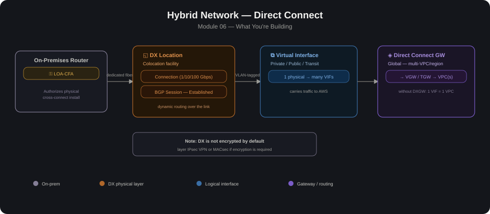

# 06 — Hybrid Network: Direct Connect

## Overview
This module covers AWS Direct Connect (DX) — a dedicated, private network connection from an on-premises location to AWS, bypassing the public internet entirely. Unlike Site-to-Site VPN (Module 05), which tunnels over the public internet, Direct Connect uses a physical fiber link into an AWS Direct Connect location (colocation facility), giving more consistent bandwidth, lower latency, and no internet exposure.

In practice, most labs simulate this since real DX requires ordering a physical cross-connect from AWS or a partner — the important part is understanding the logical components and how DX integrates with VPCs, Direct Connect Gateway, and Transit Gateway.

### Direct Connect vs. Site-to-Site VPN

| | Direct Connect | Site-to-Site VPN |
|---|---|---|
| **Path** | Dedicated private fiber circuit | Encrypted tunnel over public internet |
| **Bandwidth** | Consistent, dedicated (50 Mbps–100 Gbps) | Variable, internet-dependent |
| **Latency** | Lower and more predictable | Depends on internet path |
| **Setup time** | Days to weeks (physical provisioning) | Minutes |
| **Encryption** | Not encrypted by default (can layer VPN over DX with MACsec/IPsec) | Encrypted (IPsec) |
| **Cost model** | Port-hour + data transfer, often cheaper for high volume | Tunnel-hour + data transfer |
| **Typical use** | Production, high-throughput, latency-sensitive workloads | Backup path, low-volume, quick setup |

Many real deployments run both: DX as primary, Site-to-Site VPN as automatic failover.

## Core Components

| Component | Purpose |
|---|---|
| **Direct Connect Location** | Physical colocation facility where your router meets AWS's router. |
| **Connection** | The physical port (dedicated 1/10/100 Gbps) or hosted connection (via an AWS Direct Connect Partner) at that location. |
| **Virtual Interface (VIF)** | A logical, VLAN-tagged interface over the physical connection. Three types: Private VIF (to a VPC via VGW/DXGW), Public VIF (to AWS public services/S3 without traversing internet), Transit VIF (to a Transit Gateway via DXGW). |
| **Direct Connect Gateway (DXGW)** | A global resource that lets one DX connection reach VPCs/TGWs across multiple regions and accounts — without it, a private VIF only reaches one VPC. |
| **BGP Session** | DX uses BGP for dynamic routing — routes are exchanged automatically between your router and AWS's. |
| **LOA-CFA (Letter of Authorization – Connecting Facility Assignment)** | The document AWS issues authorizing the physical cross-connect at the DX location — needed for real (non-simulated) provisioning. |

### Two Ways to Attach to Your Network
1. **Private VIF → Virtual Private Gateway → single VPC** — Classic setup, same pattern as a VPN's VGW attachment.
2. **Transit VIF → Direct Connect Gateway → Transit Gateway → multiple spoke VPCs** — Preferred when building on the hub-and-spoke topology from Module 04 — DX becomes another TGW attachment, giving on-prem the same routed, segmented access as any spoke.

## Build Steps

> Note: physical connection ordering (steps 1–2) can't be done in a sandbox — most labs start from step 3 using a DX simulator/partner test environment, or just document the logical config.

1. **Request a Direct Connect connection** — dedicated (order directly from AWS, get an LOA-CFA, get cross-connect installed) or hosted (order through an AWS Direct Connect Partner who already has a presence at the facility).
2. **Confirm the connection is Available** in the AWS console once physical wiring completes.
3. **Create a Virtual Interface (VIF)**
   - Private VIF: point at a VGW (single VPC) or DXGW (multi-VPC/region).
   - Transit VIF: point at a DXGW that's associated with a Transit Gateway.
   - Set VLAN ID, BGP ASN (yours and Amazon's), and BGP authentication key.
4. **Create/associate a Direct Connect Gateway** (if using DXGW path) — Associate the DXGW with your VGW or Transit Gateway. For TGW: also set allowed prefixes — the specific CIDRs DX is permitted to advertise into the TGW.
5. **Establish BGP peering** — Configure your on-prem/CPE router with the BGP details AWS provides. Confirm BGP session state = Established and routes are being exchanged in both directions.
6. **Update VPC / TGW route tables** — Propagate the DX-learned routes into the right route table(s), and add routes in VPC subnets pointing at the VGW/TGW for on-prem CIDRs.
7. **(Optional) Configure VPN as backup** — Set up a Site-to-Site VPN over the internet as a failover path; use BGP path prepending or local preference so DX is preferred when up.
8. **Test connectivity and failover** — Confirm instance-to-on-prem reachability over DX, then simulate DX failure (e.g., disable the VIF or drop BGP) and confirm traffic fails over to VPN if configured.

## Lessons Learned

- DX is not encrypted by default — if data must be encrypted in transit, layer IPsec VPN over the DX private VIF, or use MACsec (available on certain dedicated connection speeds) for link-layer encryption.
- A private VIF only reaches one VPC unless a Direct Connect Gateway is used — a common mistake is expecting a private VIF alone to reach multiple VPCs.
- Allowed prefixes matter on Transit VIFs — if the allowed prefix list on the DXGW-to-TGW association isn't updated, new on-prem CIDRs won't be learned even if BGP has them.
- BGP ASN conflicts — using the same ASN on both ends (or an ASN already in use elsewhere in the network) breaks peering; ASN allocation needs planning.
- Physical provisioning is slow — real DX orders can take days to weeks; a VPN fallback is worth planning for if there's a hard deadline.
- Hosted vs. dedicated connections differ in who owns capacity management — hosted connections have fixed bandwidth set by the partner and can't be resized without re-ordering.
- Public VIFs need care — they can reach all AWS public IP ranges globally, which is powerful but also a broader attack surface if not paired with proper route filtering/BGP communities.
- **Once you've completed this lab, delete the resources you created** (EC2 instances, VPN connections if used as backup) — leftover resources will keep charging your AWS account every month if left running.

## Validation Checklist

- [ ] Connection status = Available
- [ ] VIF status = Available, BGP state = Established (`aws directconnect describe-virtual-interfaces`)
- [ ] Expected on-prem CIDRs appear in the VPC/TGW route table
- [ ] Expected AWS CIDRs are being advertised to on-prem (check on-prem router's BGP table)
- [ ] Instance in AWS can reach on-prem resource, and vice versa
- [ ] If VPN backup configured: disable DX path and confirm automatic failover to VPN, then confirm failback when DX is restored
