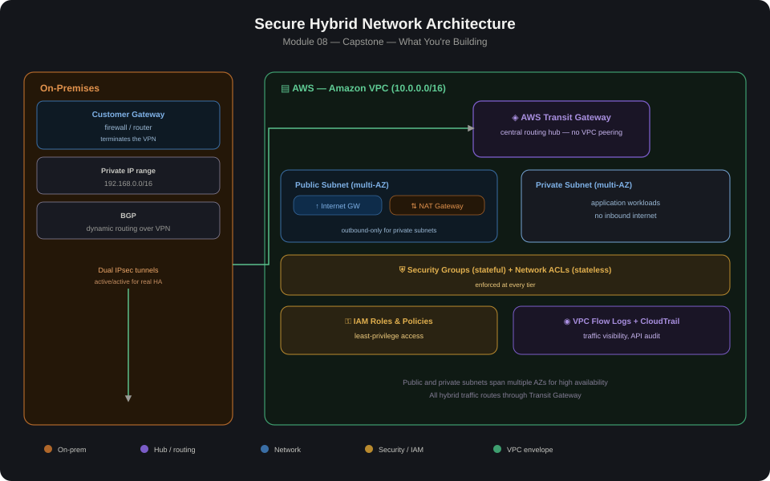

# 08 — Secure Hybrid Network Architecture (Capstone)

Full detailed diagram: [architecture-diagram.png](./architecture-diagram.png)

## Overview
This capstone project demonstrates the design and implementation of a secure, scalable hybrid network architecture connecting an on-premises data center to AWS. The architecture follows AWS best practices for security, high availability, and network segmentation — bringing together Transit Gateway, Site-to-Site VPN, and private VPC design from across this portfolio into one integrated reference architecture. The goal is secure private connectivity, centralized traffic control, and scalability for multi-VPC environments.

### Objectives
- Securely connect on-premises infrastructure to AWS
- Centralize routing and control using AWS Transit Gateway
- Implement defense-in-depth network security
- Enable high availability and failover
- Provide visibility and monitoring for network traffic

## Core Components

| Side | Component | Role |
|---|---|---|
| On-Premises | Customer Gateway | Firewall / router terminating the VPN on the on-prem side |
| On-Premises | Private IP range | Example: `192.168.0.0/16` |
| On-Premises | BGP | Enabled for dynamic routing over the VPN |
| AWS | Amazon VPC | `10.0.0.0/16` |
| AWS | Public and private subnets | Spread across multiple AZs |
| AWS | AWS Transit Gateway | Central routing hub |
| AWS | Site-to-Site IPsec VPN | Dual tunnels for redundancy |
| AWS | NAT Gateway | Outbound internet access for private subnets |
| AWS | Internet Gateway | Public subnets only |
| AWS | Security Groups and Network ACLs | Instance- and subnet-level filtering |
| AWS | IAM roles and policies | Least-privilege access control |
| AWS | VPC Flow Logs and CloudTrail | Traffic visibility and API auditing |

### Traffic Flow

**On-prem → AWS private EC2**
1. Traffic leaves the on-prem router
2. Encrypted via IPsec tunnel
3. Reaches AWS Transit Gateway
4. Routed to the target VPC attachment
5. Delivered to the private EC2 instance

**AWS → Internet (outbound only)**
1. Private EC2 sends traffic to the NAT Gateway
2. NAT Gateway routes traffic via the Internet Gateway
3. No inbound internet access to private subnets

### Security Design

**Defense in depth**
- Encrypted IPsec tunnels for hybrid connectivity
- TLS for application-level communication
- Security Groups (stateful, instance-level)
- Network ACLs (stateless, subnet-level)
- IAM least-privilege access

**Network segmentation**
- No direct VPC-to-VPC peering
- All traffic routed through Transit Gateway
- Separate route tables per VPC
- Shared services isolated from application workloads

### High Availability & Resilience
- Dual VPN tunnels (active/active)
- Multi-AZ subnets
- Highly available Transit Gateway
- NAT Gateway per AZ
- BGP-based failover for hybrid connectivity

### Monitoring & Logging
- VPC Flow Logs for traffic visibility
- Transit Gateway Flow Logs
- CloudWatch metrics and alarms
- CloudTrail for API auditing
- AWS Config for compliance monitoring

### Tools & Services Used
Amazon VPC · AWS Transit Gateway · Site-to-Site VPN · Amazon EC2 · Amazon CloudWatch · AWS CloudTrail · IAM · AWS Direct Connect

## Build Steps

1. Design the AWS-side VPC (`10.0.0.0/16`) with public and private subnets across 2+ AZs — see [Module 01](../01-vpc-networking-basics) for the base pattern.
2. Deploy the Transit Gateway as the central hub — see [Module 04](../04-transit-gateway-hub-spoke) for attachment and route table design.
3. Establish Site-to-Site VPN with dual tunnels from the on-prem Customer Gateway — see [Module 05](../05-site-to-site-vpn-lab).
4. (Optional, production path) Add Direct Connect as the primary hybrid path with VPN as BGP-preferred backup — see [Module 06](../06-hybrid-network-direct-connect).
5. Deploy NAT Gateway(s) for private-subnet outbound access — one per AZ for full HA, or a Regional NAT Gateway (see [Module 07](../07-aws-regional-nat-gateway)) to simplify multi-AZ management.
6. Apply security groups (stateful) and NACLs (stateless) per tier, enforcing least-privilege at every layer.
7. Enable VPC Flow Logs, Transit Gateway Flow Logs, CloudTrail, and AWS Config for full traffic and API visibility.
8. Validate end-to-end: confirm on-prem can reach private AWS resources only through the VPN/TGW path, and that private subnets have outbound-only internet access via NAT.

## Lessons Learned

- Routing everything through Transit Gateway (rather than VPC peering) keeps segmentation clean and makes it possible to enforce "no direct spoke-to-spoke" policies in one place instead of per-VPC.
- Dual VPN tunnels only provide real HA if both the on-prem CGW and AWS side are configured for active/active — a passive second tunnel can silently reintroduce a single point of failure.
- Flow Logs at both the VPC and Transit Gateway level give a more complete picture — VPC Flow Logs alone don't show cross-VPC transit traffic clearly.
- Keeping shared services (monitoring, logging, shared tooling) in their own VPC/route table, isolated from application workloads, is a common pattern that makes least-privilege IAM and security group rules easier to reason about.
- **Once you've completed this lab, delete the resources you created** — EC2 instances, VPN connections, Transit Gateway attachments, and the Transit Gateway itself — otherwise these will keep charging your AWS account every month.

## Validation Checklist

- [ ] On-prem instance can reach a private EC2 instance in AWS only via the VPN tunnel (not directly over the internet)
- [ ] Both VPN tunnels show `UP` status, and failover works if one is taken down
- [ ] Private EC2 instances have outbound internet access via NAT, but are not reachable inbound from the internet
- [ ] Transit Gateway route tables correctly restrict spoke-to-spoke traffic where it should be denied
- [ ] VPC Flow Logs, TGW Flow Logs, and CloudTrail are actively logging and queryable
- [ ] IAM roles follow least-privilege (no wildcard `*` permissions on production roles)
