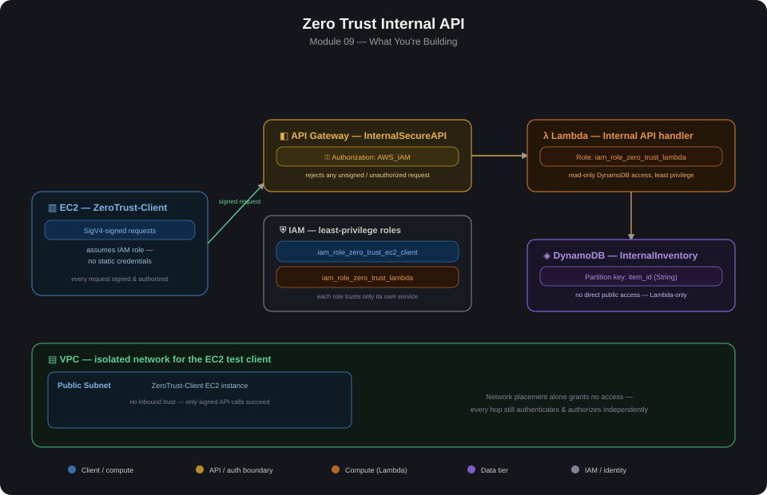

# 09 — Zero Trust Internal API

Full walkthrough: [WALKTHROUGH.md](./WALKTHROUGH.md)

## Overview
This module builds a Zero Trust internal API on AWS serverless services. Zero Trust means no component is trusted by default just because it's inside the network — every request is authenticated and authorized independently, at every hop, regardless of where it originates.

Concretely: an EC2 client signs every request with SigV4 (no static API keys), API Gateway enforces `AWS_IAM` authorization (rejecting anything unsigned or unauthorized before it ever reaches application code), and Lambda runs under a role scoped to read-only DynamoDB access — nothing more than it needs.

*Built from a customized lab template — the steps and screenshots below reflect what was actually configured and tested in a real AWS account, not the original template's generic instructions.*

## Core Components

| Component | Purpose |
|---|---|
| **VPC (public subnet)** | Hosts the EC2 test client — network placement alone grants no API access |
| **EC2 — ZeroTrust-Client** | Test client that signs every request with SigV4 using its assumed IAM role, not stored credentials |
| **IAM Role — `iam_role_zero_trust_ec2_client`** | Grants the EC2 instance only what it needs to call the API — no broader permissions |
| **IAM Role — `iam_role_zero_trust_lambda`** | Grants Lambda read-only DynamoDB access and basic CloudWatch logging — nothing else |
| **API Gateway — InternalSecureAPI** | REST API with `AWS_IAM` authorization — every request must be SigV4-signed or it's rejected before reaching Lambda |
| **Lambda — internal API handler** | Processes authorized requests and reads from DynamoDB |
| **DynamoDB — InternalInventory** | Stores inventory data; partition key `item_id` (String); no direct public access |

## Build Steps

1. Create a VPC with a public subnet to host the test client.
2. Create the `InternalInventory` DynamoDB table with partition key `item_id` (String), and add a test item (`item_id: gadget_001`, `status: Top Secret`).
3. Create two IAM roles following least privilege:
   - `iam_role_zero_trust_lambda` — trusts `lambda.amazonaws.com`, attached policies: `AmazonDynamoDBReadOnlyAccess`, `AWSLambdaBasicExecutionRole`
   - `iam_role_zero_trust_ec2_client` — trusts EC2, scoped only to invoke the API
4. Create the Lambda function using the `iam_role_zero_trust_lambda` role, with handler code that reads from `InternalInventory` and returns the result as JSON.
5. Create the API Gateway REST API (`InternalSecureAPI`) with a Lambda integration, and set the method's authorization to **AWS_IAM**.
6. Deploy the API to a `prod` stage and copy the Invoke URL.
7. Launch the `ZeroTrust-Client` EC2 instance in the public subnet, attached to `iam_role_zero_trust_ec2_client` — no access keys stored on the instance.
8. Connect to the instance via EC2 Instance Connect, install `boto3` and `requests`, and write a test script that uses `botocore`'s `SigV4Auth` to sign a `GET` request to the API URL using the instance's assumed role credentials.
9. Run the test script — a successful response confirms the full chain: signed request → API Gateway IAM check → Lambda → DynamoDB → response.

## Lessons Learned

- **Network location isn't a security boundary here on purpose.** The EC2 client sits in a plain public subnet — Zero Trust means the API doesn't trust it any more for being "inside" the VPC. The only thing that grants access is a valid SigV4 signature tied to an authorized IAM role.
- **`AWS_IAM` authorization on API Gateway rejects unsigned requests before Lambda ever runs** — this pushes the authorization check to the edge of the system rather than relying on application code to check credentials, which is a meaningfully different (and stronger) pattern than "check auth inside the handler."
- **Two IAM roles with different trust policies, not one shared role** — the Lambda role trusts `lambda.amazonaws.com` and can read DynamoDB; the EC2 role trusts EC2 and can only call the API. Neither role can do the other's job, which is the least-privilege principle in practice, not just in theory.
- **SigV4 signing from a script is more involved than an API key header** — the test script has to pull the instance's assumed-role credentials via `boto3`, then use `botocore.auth.SigV4Auth` to sign the request manually before sending it with `requests`. This friction is intentional — it's harder to accidentally leak a long-lived credential when there isn't one to leak.

## Validation Checklist

- [ ] DynamoDB table `InternalInventory` exists with partition key `item_id` and contains test data — see [`evidence/vpc-created.png`](./evidence/vpc-created.png) for the underlying VPC setup
- [ ] `iam_role_zero_trust_lambda` and `iam_role_zero_trust_ec2_client` exist with distinct trust policies and minimal attached permissions
- [ ] API Gateway method authorization is set to `AWS_IAM` (not `NONE`) — see [`evidence/api-gateway-iam-auth.png`](./evidence/api-gateway-iam-auth.png)
- [ ] Calling the API URL directly (e.g., via browser or unsigned `curl`) returns an authorization error, not data
- [ ] Running the SigV4-signed test script from the EC2 client returns HTTP 200 with inventory data — see [`evidence/test-result-success.png`](./evidence/test-result-success.png) for the actual test output
- [ ] CloudWatch logs for the Lambda function show the successful invocation
