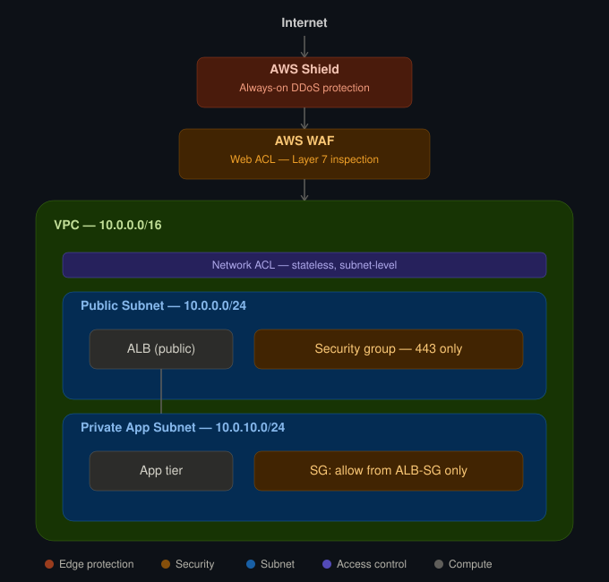

# 10 — Network Security: AWS WAF & Shield

## Overview

This module builds a layered edge-security stack in front of a public-facing
application — combining AWS WAF (Layer 7 filtering), AWS Shield (DDoS protection),
Security Groups, and NACLs — to demonstrate defense-in-depth at the network edge.

The goal is to show how traffic is inspected and filtered *before* it ever reaches
application infrastructure, and how each security layer covers a different attack
surface (L3/L4 vs L7, volumetric vs application-layer).

**Why this matters:** a public ALB or CloudFront distribution with only Security
Groups is exposed to SQL injection, XSS, bad bots, and Layer 7 floods — none of
which a Security Group can see, since Security Groups only filter on IP/port, not
request content. WAF and Shield close that gap.

## Core Components

- **AWS WAF** — Web ACL with managed rule groups (Core rule set, known bad inputs,
  IP reputation) plus custom rate-based rules
- **AWS Shield Standard** — always-on DDoS protection (included by default on
  ALB/CloudFront)
- **Security Groups** — stateful, instance/ENI-level allow rules
- **Network ACLs** — stateless, subnet-level allow/deny rules as a second layer
- **Application Load Balancer** — the protected public entry point
- **CloudWatch** — WAF request sampling, blocked-request metrics, and alarms

## Architecture

**Traffic flow:** Internet → Shield (DDoS scrubbing) → WAF (request inspection) →
ALB → Security Group (stateful allow) → App tier → NACL (stateless allow, second
layer) at the subnet boundary.

## Security Design

- **Layered filtering** — Shield handles volumetric/network-layer attacks WAF can't
  see; WAF handles application-layer attacks Shield doesn't inspect (SQLi, XSS,
  bad bots); Security Groups and NACLs enforce least-privilege network access
  underneath both.
- **Managed + custom rules** — start from AWS Managed Rule Groups (Core Rule Set,
  Known Bad Inputs), then add custom rate-based rules tuned to expected traffic.
- **Least privilege at every layer** — ALB Security Group only allows 443 from
  the internet; App-tier Security Group only allows traffic from the ALB's
  Security Group (not by IP/CIDR); NACLs add a stateless backstop at the subnet
  boundary.

## Build Steps

> _Fill in the exact order of operations as you actually build this — console
> steps or CloudFormation/Terraform, in the sequence you did them. Suggested
> order below as a starting point:_

1. Deploy the ALB in public subnets (or reuse the one from Module 03)
2. Create the WAF Web ACL, associate managed rule groups
3. Add a custom rate-based rule (e.g., block IPs exceeding N requests / 5 min)
4. Associate the Web ACL with the ALB
5. Confirm Shield Standard is active (automatic — no action needed, but verify
   in the Shield console)
6. Tighten Security Groups: ALB-SG (public → 443 only), App-SG (ALB-SG → app port only)
7. Add NACL rules at the subnet level as a second, stateless layer
8. Generate test traffic to trigger WAF rules and confirm blocking behavior

## Lessons Learned

> _This is the section that makes the module credible — replace this with the
> real issues you hit. A few common ones to watch for while building, in case
> they come up for you:_
> - Web ACL region scope: WAF for ALB is regional, WAF for CloudFront must be
>   created in us-east-1 regardless of where your app lives
> - Managed rule groups can false-positive on legitimate traffic — check the
>   sampled requests before assuming a block is correct
> - NACL rules are stateless — forgetting the return-traffic rule is a classic
>   "works one direction, breaks the other" bug

## Validation Checklist

- [ ] WAF Web ACL is associated with the ALB and shows "Active"
- [ ] Sending a known malicious payload (e.g., a basic SQLi test string) via
      curl/browser returns a 403 from WAF, not from the app
- [ ] CloudWatch shows blocked-request metrics incrementing during test traffic
- [ ] Legitimate traffic still reaches the app successfully (no false-positive
      blocking of normal requests)
- [ ] Security Group on the app tier only allows traffic from the ALB's SG,
      confirmed by attempting a direct connection to an app instance and
      seeing it fail
- [ ] Shield Standard shown as active in the AWS Shield console
